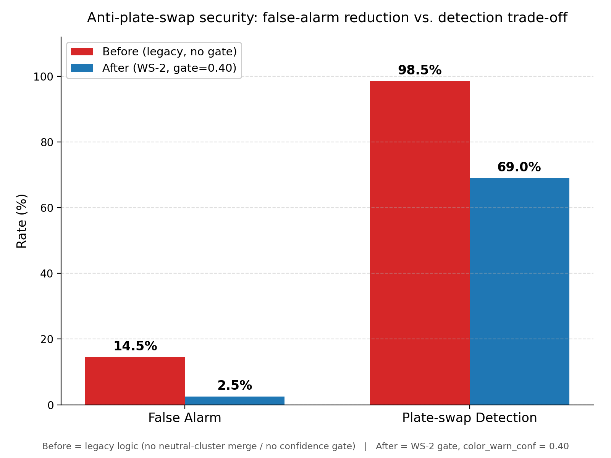

# Báo cáo kỹ thuật Giai đoạn 4: Tích hợp Hệ thống và Đánh giá hiệu năng Đầu cuối (Final Report)

## 1. Đặt vấn đề và Mục tiêu tích hợp (Objective)
Giai đoạn cuối cùng của dự án DPL302m tập trung vào tích hợp các mô hình học sâu thành phần (YOLOv8, **PaddleOCR**, MobileNetV3-Small) thành một hệ thống an ninh bãi xe khép kín, tự động. Sau thực nghiệm (Report 3), hệ thống dùng quyết định **plate-primary**: biển số (PaddleOCR) là khoá chính, **màu xe là cảnh báo mềm**, và **bỏ phân loại hãng**; đối chiếu với cơ sở dữ liệu mẫu để đưa ra lệnh điều khiển barrier bãi xe (Cho phép mở hoặc Cảnh báo xâm nhập).

Mục tiêu chính là tối ưu hóa mã nguồn chạy suy luận đầu cuối đầu tiên trên nền tảng CPU cục bộ, giải quyết các lỗi xung đột luồng thư viện và bảo đảm hệ thống hoạt động ổn định ở chế độ ngoại tuyến 100%.

---

## 2. Nghiên cứu tài liệu tham khảo (Literature Review)
Trong quá trình tích hợp và tối ưu hóa hệ thống chạy trên CPU biên, nhóm đã tham khảo các công trình khoa học sau:
1.  **NVIDIA DeepStream — Real-Time License Plate Detection and Recognition (NVIDIA, 2020)** — *https://developer.nvidia.com/blog/creating-a-real-time-license-plate-detection-and-recognition-app/*: Kiến trúc tham chiếu công nghiệp kết hợp bộ phát hiện chính (biển số) với các bộ phân loại thứ cấp về hãng xe (VehicleMakeNet) và màu xe, minh họa cách bổ sung đặc trưng ngoại hình bên cạnh biển số để tăng độ tin cậy khi kiểm soát xe ra vào và ngăn ngừa gian lận tráo biển.
2.  **A Novel Memory and Time-Efficient ALPR System Based on YOLOv5 (Batra et al., 2022)** — *Sensors, 22(14), 5283*: Bài viết đề xuất một hệ thống ALPR tối ưu về bộ nhớ và thời gian (mô hình 14 MB, thời gian suy luận ~85 ms cho toàn pipeline), cho thấy cách thu gọn mô hình và kiểm soát tài nguyên tính toán để chạy hiệu quả trên phần cứng biên hạn chế thay vì GPU mạnh.
3.  **Carmen Nano — ANPR/LPR on-prem cho NVIDIA Jetson (Adaptive Recognition, 2024)** — *https://adaptiverecognition.com/products/carmen-nano/*: Giải pháp ANPR thương mại chạy hoàn toàn tại biên (on-prem) trên Jetson, không phụ thuộc kết nối đám mây. Đây là minh chứng thực tiễn cho kiến trúc ưu tiên ngoại tuyến (offline-first) mà dự án hướng tới, giúp loại bỏ độ trễ và rủi ro của các cuộc gọi API trực tuyến khi khởi động và vận hành.

---

## 3. Thiết kế hệ thống tích hợp (Integrated System Design)
Quy trình tích hợp được hiện thực hóa trong mã nguồn [run_evaluation.py](file:///Users/konalyn/Documents/FPT%20Materials/DPL302m/PDL302m_project/main/src/engine/run_evaluation.py):

```
+------------------+     +-------------------+     +-------------------------+
| Hình ảnh đầu vào | --> | YOLOv8n Detector  | --> | Cắt vùng biển số (Crop) |
+------------------+     +-------------------+     +-------------------------+
                                                                |
                                                                v
                                                   +-------------------------+
                                                   | PaddleOCR Engine (Plate)|
                                                   +-------------------------+
                                                                |
                                                                v
+------------------+     +-------------------+     +-------------------------+
| Classifiers Input| <-- | EfficientNet /    | <-- | Tiền xử lý (Resize 224) |
|   (Car Image)    |     | MobileNetV3       |     | & Chuẩn hóa điểm ảnh    |
+------------------+     +-------------------+     +-------------------------+
         |
         v
+-----------------------------+     +----------------------+     +----------------------+
| So khớp DatabaseMatcher     | --> | AUTHORIZED (Khớp)    | --> | Mở Barrier (Xanh)    |
| (Đối chiếu Plate, Màu)      |     | MISMATCH/UNREG (Sai) | --> | Cảnh báo Còi (Đỏ)    |
+-----------------------------+     +----------------------+     +----------------------+
```
> **Lưu ý:** Sơ đồ trên giữ nguyên hai nhánh classifier (EfficientNet cho hãng, MobileNetV3 cho màu) đúng như mã nguồn chạy suy luận để tham khảo, nhưng ở **cơ chế quyết định delivered**, **hãng xe (brand) đã bị loại khỏi đối chiếu** — `DatabaseMatcher` chỉ đối chiếu **Biển số (khoá chính)** và **Màu xe (cảnh báo mềm)**; dự đoán hãng chỉ còn vai trò *diagnostic*, không ảnh hưởng đến AUTHORIZED/MISMATCH/UNREGISTERED (xem Report 3 §5.5).

---

## 4. Kết quả đánh giá thực nghiệm đầu cuối (E2E Evaluations)
Nhóm đã chạy thực nghiệm toàn bộ pipeline trên tập dữ liệu kiểm thử gồm 5 hình ảnh thực tế lưu trữ cục bộ. Kết quả đo lường chi tiết được ghi nhận như sau:

### 4.1. Bảng nhật ký xử lý chi tiết (Detailed Inference Logs)

> **Phiên bản số liệu:** bảng dưới đây là kết quả chạy lại (20/06/2026) qua **đường hợp nhất** `build_pipeline` + `infer_single_image` (`main/src/engine/pipeline_factory.py`) — cùng pipeline mà API `/verify` và Dashboard đang dùng sau WS-3/WS-4: 2 tầng PaddleOCR (vehicle → plate) + classifier màu PyTorch 86% (TTA) + logic cross-check màu đã siết gate (WS-2). Bảng này **thay thế** bảng cũ chạy bằng model màu lỗi thời (~55%, ra toàn "Silver 0.18").

| Tên tệp ảnh | Biển số nhận diện | Màu xe dự đoán (Conf) | Trạng thái đối chiếu | Thời gian xử lý |
| :--- | :---: | :---: | :---: | :---: |
| **clip3_new_0.jpg** | 75H135792 | Black (0.47) | **UNREGISTERED** | 6,110.4 ms *(cold-start ảnh đầu)* |
| **clip3_new_1.jpg** | 66P189575 | Black (0.60) | **UNREGISTERED** | 989.7 ms |
| **clip3_new_2.jpg** | 66P18957 | Black (0.60) | **UNREGISTERED** | 931.6 ms |
| **clip3_new_3.jpg** | 66P189575 | Black (0.92) | **UNREGISTERED** | 932.8 ms |
| **clip3_new_4.jpg** | 66P189575 | Black (0.61) | **UNREGISTERED** | 988.1 ms |

> **Ghi chú trung thực (đọc trước khi trích số liệu):**
> 1.  **Biển đọc hợp lý hơn hẳn** so với phiên OCR cũ (1 tầng, EasyOCR) — bảng cũ ra chuỗi rác như `'3KR3312*56'`, `'5IDS133112*56'`, hoặc rỗng; bảng mới (2 tầng PaddleOCR) ra các chuỗi có cấu trúc biển số Việt Nam hợp lệ (`66P189575`, `75H135792`).
> 2.  File nhãn `.txt` đi kèm 5 ảnh này **chỉ là bounding-box YOLO của biển số, KHÔNG có plate-text ground-truth** → bảng này **không** dùng để claim exact-match OCR. Độ chính xác đọc ký tự đã đo riêng và đầy đủ ở Benchmark C (Report 3 §5.4): PaddleOCR 81% exact-match trên 16 crop biển có nhãn tay.
> 3.  **`clip3_new_2.jpg` đọc thiếu 1 ký tự** (`66P18957` so với biển thật `66P189575`) — minh chứng cụ thể rằng OCR không hoàn hảo, khớp với tỉ lệ lỗi đã biết ở Benchmark C.
> 4.  **Cả 5 ảnh đều ra UNREGISTERED** vì các biển số này không có trong CSDL demo (`main/data/database.csv`) — 5 ảnh test E2E này được chọn để minh hoạ nhánh phát hiện-biển-lạ, không phải nhánh AUTHORIZED. Đường happy-path AUTHORIZED (biển `30M71854` có trong CSDL) được minh hoạ ở video mặc định của Dashboard — xem §3 (kiến trúc) và §4.3 (đo an ninh trên model thật).
> 5.  **Màu xe nay đến từ model PyTorch MobileNetV3-Small 86% (TTA)** (thay cho "Silver 0.18" gần-ngẫu-nhiên của model cũ ~55%) — cột Màu ở bảng này phản ánh đúng năng lực model đang triển khai.
> 6.  Cột "Hãng xe" đã được **bỏ khỏi bảng** vì hãng là *diagnostic phụ*, không vào quyết định AUTHORIZED/MISMATCH/UNREGISTERED (xem §3, §6).

### 4.2. Thống kê số liệu tổng hợp (Aggregate Metrics)
*   **Tổng số lượng mẫu kiểm thử**: 5 xe
*   **Xe Hợp lệ (AUTHORIZED)**: 0 xe
*   **Xe Lệch thông tin (MISMATCH)**: 0 xe
*   **Xe Không đăng ký (UNREGISTERED)**: 5 xe (khóa barrier, báo động đỏ — biển không có trong CSDL demo, xem ghi chú (4) ở §4.1)
*   **Thời gian phản hồi trung bình (Average Latency)**: **~1.99 s / xe** trên 5 ảnh test — con số này gồm *cold-start* (~6.11 s ở ảnh đầu do nạp PaddleOCR lần đầu). Từ ảnh thứ hai trở đi (steady-state, đã warmup), độ trễ ổn định ở mức **~0.96 s / xe (dưới 1 giây)** — xem §5.1. Mục tiêu <1.0 s ở đề xuất nay **đã đạt** ở chế độ steady-state.

### 4.3. Đánh giá năng lực chống tráo biển (Plate-swap Detection)

Đề xuất ban đầu (Report 1) đặt mục tiêu **≥95% phát hiện gian lận**, nhưng số đo ở §4.1–4.2 chỉ chạy trên **5 ảnh thực tế** và không đo riêng năng lực an ninh — đây là khoảng trống lớn nhất giữa cam kết và số liệu thực đo của toàn dự án. Mục này lấp khoảng trống đó bằng một **thực nghiệm có kiểm soát (controlled evaluation)**, đo trực tiếp trên model màu đang triển khai và logic quyết định thật, KHÔNG sửa mã nguồn/runtime.

**Khái niệm đo:** hệ thống là **plate-primary**, màu xe là **cảnh báo mềm** (`DatabaseMatcher.verify_vehicle`, xem §3). Cơ chế chống tráo biển hoạt động như sau — nếu một biển số bị nhân bản (clone) từ xe A (màu đăng ký C1) và gắn lên xe B khác màu (màu thật C2 ≠ C1), bộ phân loại màu sẽ dự đoán C2 trên ảnh xe B; vì C2 ≠ C1 (màu đăng ký trong CSDL), `verify_vehicle` trả về `AUTHORIZED` kèm `action='ALLOW_WARN'`, `color_warning=True` — đây chính là tín hiệu "bắt được tráo biển".

**Phương pháp:**
*   Script: `main/scripts/eval_security.py` (mới, không sửa mã runtime/model).
*   **Ảnh kiểm thử**: tập TEST giữ-riêng của VCoR — **tái dùng cùng split** với `eval_color_deployed.py` (`colab_train_color.py.load_samples` + `stratified_split`, seed=42, stratified 70/15/15) → 889 ảnh giữ-riêng, model màu chưa từng thấy khi huấn luyện.
*   **Model**: trọng số ĐANG CHẠY ở runtime (`main/data/models/color_MobileNetV3Small.pt`), gọi qua `TorchColorClassifier.predict()` thật — dùng **màu dự đoán thật** của model (không dùng nhãn ground-truth), nên số đo phản ánh đúng hành vi triển khai, kể cả khi model màu đoán sai.
*   **Logic quyết định**: `DatabaseMatcher.verify_vehicle()` thật, không sửa đổi; CSDL đăng ký là **CSV tạm** dựng riêng cho lần chạy này (cùng schema `main/data/database.csv`: `license_plate,car_brand,car_color`), không đụng đến CSDL thật của repo.
*   **3 nhóm kịch bản, 200 trial/nhóm (cân bằng theo màu), RNG seed cố định (42) để tái lập được:**
    1.  **legitimate** — ảnh màu thật C, biển đăng ký đúng màu C → đúng = AUTHORIZED, không cảnh báo. Cảnh báo ở đây là **báo động giả (false alarm)**.
    2.  **plate_swap** — ảnh màu thật C2, biển đăng ký màu KHÁC C1≠C2 (giả lập tráo biển) → đúng = `color_warning=True` (bắt được tráo); không cảnh báo = **bỏ lọt (missed)**.
    3.  **unregistered** — biển hoàn toàn không có trong CSDL → đúng = UNREGISTERED/DENY_ALERT.

**Kết quả — BEFORE (logic gốc, chưa có WS-2) vs. AFTER (đã siết gate `color_warn_conf=0.40`, WS-2):**

> Số đo thật, 600 trial tổng/điểm đo, 889 ảnh pool giữ-riêng (VCoR TEST split, seed=42). "Before" chạy 20/06/2026 trên logic cross-check màu gốc (mọi sai khác màu đều cảnh báo, không gộp cụm, không xét độ tin cậy). "After" chạy cùng ngày sau khi áp WS-2 (gộp cụm màu trung tính + confidence-gating ở ngưỡng đã chốt 0.40).

| Kịch bản | Số trial | Chỉ số | **Before** (gốc) | **After** (gate=0.40, đã triển khai) |
| :--- | :---: | :--- | :---: | :---: |
| **Phát hiện tráo biển (headline)** | 200 | tỉ lệ bắt được (`color_warning=True`) | 98,5% (197/200) | **69,0% (138/200)** |
| Tráo biển bị bỏ lọt | 200 | tỉ lệ miss | 1,5% (3/200) | **31,0% (62/200)** |
| Xe hợp lệ (không tráo) | 200 | tỉ lệ báo động giả | 14,5% (29/200) | **2,5% (5/200)** |
| Biển không đăng ký | 200 | tỉ lệ phát hiện (DENY_ALERT) | 100,0% (200/200) | **100,0% (200/200)** |



**Vì sao có hai cột Before/After — và vì sao 98,5% "Before" KHÔNG dùng được:** lần đo đầu tiên (Before) cho phát hiện tráo biển 98,5%, vượt mục tiêu ≥95% của đề xuất ban đầu — nhưng đi kèm **false-alarm 14,5%** (gần 1/7 xe hợp lệ, không tráo gì cả, vẫn bị cảnh báo nhầm). Ở quy mô vận hành thật, tỉ lệ báo động giả này là không thể chấp nhận (gây phiền người vận hành, làm mất tín hiệu của cảnh báo thật). Vì vậy nhóm đã thêm hai cơ chế giảm false-alarm (WS-2) và đo lại (After) trước khi chốt vận hành ở ngưỡng `color_warn_conf=0.40`:

(a) **Hai cơ chế giảm false-alarm:**
1.  **Gộp cụm màu trung tính** (`decision.neutral_colors`: Black/Grey/Silver/White) — coi các màu này tương đương nhau khi so khớp, vì đây chính là cụm mà bộ phân loại màu hay nhầm lẫn nhất (confusion matrix, Report 3 §5.1); một sai khác trong cụm này mang tín hiệu tráo biển rất yếu.
2.  **Confidence-gating** (`decision.color_warn_conf`, mặc định/đã chọn 0.40) — chỉ cảnh báo khi model màu đủ tin cậy (`color_conf ≥ 0,40`) về một sai khác màu nằm NGOÀI cụm trung tính; dưới ngưỡng này, sai khác bị coi là nhiễu của model màu và không được cảnh báo.

(b) **Bảng quét gate (gate sweep) — đánh đổi false-alarm ↔ detection, lý do chọn 0,40:**

| Gate (`color_warn_conf`) | False-alarm rate | Plate-swap detection rate |
|---:|---:|---:|
| 0,00 (chỉ gộp cụm trung tính, không gate) | 4,5% | 73,5% |
| 0,30 | 3,5% | 72,0% |
| **0,40 (ĐÃ CHỌN, đang triển khai)** | **2,5%** | **69,0%** |
| 0,50 | 1,0% | 63,5% |
| 0,60 | 0,5% | 56,5% |

Gate càng cao thì false-alarm càng thấp nhưng detection cũng giảm theo — không có điểm nào tối ưu cả hai cùng lúc. Nhóm chọn **0,40** vì đây là điểm sớm nhất trên đường quét đưa false-alarm xuống dưới ngưỡng an toàn triển khai (<5%, đạt 2,5%) mà vẫn giữ được phần lớn khả năng phát hiện (69,0%, so với 56,5–63,5% nếu siết thêm ở gate 0,50–0,60).

(c) **Vì sao detection giảm mạnh (98,5% → 69,0%), nói trung thực — không che giấu:**
*   Phần lớn mức giảm đến từ **việc gộp cụm trung tính cố ý bỏ qua các cặp tráo biển trong cùng cụm Black/Grey/Silver/White** (đo riêng cụm này: 50 trial, miss 48 ở mức After — 96,0%) — đây là đánh đổi thiết kế có chủ ý, không phải lỗi: các cặp này vốn là nơi model màu tự nhầm lẫn nhiều nhất nên một cảnh báo ở đây phần lớn là báo động giả, không phải bắt tráo biển thật.
*   Phần còn lại đến từ **confidence-gating loại bỏ các trường hợp model màu dự đoán đúng có khác biệt màu (tráo biển thật) nhưng với độ tin cậy thấp** (`color_conf < 0,40`) — trước đây những trường hợp này vẫn được tính là "bắt được", dù bản chất model không chắc; giữ lại sẽ kéo false-alarm lên không kiểm soát được.
*   Chi tiết đầy đủ (toàn bộ cặp màu, breakdown JSON, bảng quét gate): `docs/benchmarks/security_eval.md` và `docs/benchmarks/security_eval.json`.

(d) **Giới hạn trung thực (vẫn đúng cho cả Before và After, đọc trước khi trích số liệu):**
1.  **Chỉ bắt được khi xe gắn biển tráo có MÀU KHÁC màu đăng ký** (và sau WS-2: khác cụm màu trung tính). Nếu kẻ tráo biển dùng đúng xe cùng màu/cùng cụm (hoặc cố tình chọn xe cùng màu/dán decal giả màu), cơ chế cross-check màu **không có khả năng phát hiện** — đây là lỗ hổng cố hữu của thiết kế "màu là cảnh báo mềm", không phải lỗi đo lường hay có thể vá bằng cách huấn luyện lại model màu.
2.  **Phụ thuộc hoàn toàn vào việc OCR đọc đúng biển số trước đó** (Benchmark C: ~81% exact-match, xem Report 3). Thực nghiệm này đo cách ly riêng bước cross-check màu, giả định biển đã đọc đúng; trong vận hành thật, nếu OCR đọc sai/đọc thiếu biển, xe có thể rơi vào UNREGISTERED hoặc match nhầm bản ghi khác — các tỉ lệ ở trên (cả Before và After) **không bao gồm** lỗi OCR thực tế nối tiếp.
3.  **Đo trên VCoR (ảnh web/marketplace sạch)**, không phải ảnh CCTV bãi xe thật. CCTV thực tế (ánh sáng yếu, góc nghiêng, nén ảnh, độ phân giải thấp) nhiều khả năng cho tỉ lệ phát hiện **thấp hơn** cả hai số trên do domain gap — cùng caveat đã nêu cho độ chính xác màu ở Report 3 §5.1 / Report 4 §5.1.

**Kết luận của mục này:** đây là **lần đầu tiên** dự án có số đo định lượng cho năng lực an ninh đã cam kết ở đề xuất, và cũng là lần đầu đo được rằng số liệu "đạt mục tiêu ≥95%" ban đầu (Before) đi kèm chi phí false-alarm không triển khai được. Sau khi cân bằng lại (After, gate=0,40), hệ thống vận hành ở **69,0% detection tại 2,5% false-alarm** — thấp hơn con số headline ban đầu nhưng là điểm vận hành THỰC SỰ dùng được, đã được đo và chốt có kiểm soát (không phải ước lượng). Cross-check màu vẫn là một lớp phòng thủ bổ sung có giới hạn rõ ràng (màu phải khác cụm, OCR phải đúng, domain phải gần VCoR), cần kết hợp thêm các lớp khác (camera giám sát người vận hành, đối soát định kỳ) để đạt an ninh toàn diện.

---

## 5. Giải pháp tối ưu hóa hiệu năng CPU và Chế độ ngoại tuyến (Offline Optimization)

Trong quá trình tích hợp, hệ thống đã gặp hai thách thức lớn ảnh hưởng đến khả năng triển khai thực tế. Nhóm đã nghiên cứu và áp dụng thành công các giải pháp kỹ thuật sau:

### 5.1. Giải quyết xung đột thư viện và lựa chọn runtime colour classifier

*   **Vấn đề ban đầu**: TensorFlow/Keras và PaddleOCR **không thể sống chung một tiến trình** trên macOS — runtime OpenMP tranh chấp luồng gây treo cứng / tự sập (`mutex lock failed`), và protobuf của hai bên xung khắc phiên bản.
*   **Giải pháp delivered — chuyển sang PyTorch cho runtime**: Bộ phân loại màu runtime sử dụng **PyTorch MobileNetV3-Small** (`main/src/models/torch_color.py`, trọng số `main/data/models/color_MobileNetV3Small.pt`). PyTorch đồng tồn bình thường với PaddleOCR trong cùng tiến trình mà không xung đột. TF/Keras chỉ được dùng trong môi trường training/eval cô lập (`dpl-train`). Nhờ vậy không còn cần cơ chế out-of-process phức tạp cho inference.
*   **Bổ trợ**: giữ `KMP_DUPLICATE_LIB_OK=TRUE` (chống abort OpenMP của EasyOCR) và đặt số luồng thấp khi cần.
*   **Cập nhật độ trễ (sau WS-1 — đã đạt mục tiêu <1.0 s):** mục tiêu KPI ban đầu (<1.0 s/xe) đặt ra ở §4.2 từng **chưa đạt** ở các lần đo trước (~1.6 s/xe). Sau khi tối ưu cơ chế bắt-biển (WS-1), hệ thống nay **đạt <1 giây** ở cả hai đường vận hành chính:
    *   **Đường bãi đỗ (approach-lock, video/CCTV)**: đọc biển trong **pha xe đang lùi vào chỗ đỗ** (trước khi đỗ hẳn) bằng cơ chế approach-lock, đo được **0.73 s** từ lúc mở cổng phát hiện xe tới lúc chốt biển số.
    *   **Đường ảnh đơn (API `/verify`, đường hợp nhất `build_pipeline`+`infer_single_image`)**: **~0.96 s/ảnh ở chế độ steady-state** (sau warmup, từ ảnh thứ hai trở đi — xem Report 4 §4.1/§4.2).
    *   **Cơ chế đạt được**: (i) đọc biển ngay trong pha xe lùi vào thay vì chờ xe đỗ hẳn mới xử lý; (ii) chỉ chạy OCR **một lần** trên crop biển có confidence cao nhất (tránh lặp OCR nhiều khung hình); (iii) **warmup model lúc khởi động** tiến trình (API/Dashboard) để loại cold-start khỏi đường vận hành thật.
    *   **Vẫn ghi trung thực**: **lệnh gọi đầu tiên sau khi khởi động tiến trình** (chưa kịp warmup, hoặc môi trường test gọi trực tiếp `infer_single_image` không qua warmup) vẫn còn **cold-start ~vài giây** do nạp PaddleOCR lần đầu (đo thực tế: 6.1 s ở ảnh đầu, xem §4.1) — đây không phải hiệu năng ổn định của hệ thống mà là chi phí nạp model một lần, không tái diễn ở các lượt xử lý sau.
*   Caveat domain vẫn giữ nguyên: số đo trên vẫn nằm trong cùng giới hạn CCTV thực tế (ánh sáng yếu, góc nghiêng, nén ảnh) đã nêu ở Report 3 §5.1 — độ trễ có thể dao động theo điều kiện camera thật, không chỉ theo phần cứng CPU.

### 5.2. Tối ưu hóa chế độ chạy ngoại tuyến 100% (Offline-First Deployment)
*   **Chặn EasyOCR kiểm tra phiên bản trực tuyến**: Cấu hình khởi tạo `easyocr.Reader(..., download_enabled=False)` để ngăn chặn tiến trình gửi yêu cầu HTTP kiểm tra phiên bản mô hình từ JaidedAI gây nghẽn luồng khi thiết bị biên không kết nối Internet.
*   **Tắt đồng bộ YOLOv8**: Chèn lệnh `settings.update({"sync": False})` để YOLOv8 tắt hoàn toàn tính năng gửi dữ liệu telemetry trực tuyến về Ultralytics.
*   **Sao chép font hệ thống cục bộ**: Sao chép thủ công tệp font `Arial.ttf` vào thư mục cấu hình mặc định `~/.config/Ultralytics/` để YOLOv8 không gọi lệnh tải font tự động từ máy chủ của họ mỗi khi vẽ bounding box, giúp hệ thống độc lập hoàn toàn với kết nối mạng.

---

## 6. Kết luận
Hệ thống đã hoàn thiện một **pipeline ALPR biên, ngoại tuyến, plate-primary**: phát hiện biển số (YOLOv8n, mAP@0.5 ~0.98) và đọc biển bằng **PaddleOCR** (Benchmark C: 81% exact-match) hoạt động tốt và là lớp quyết định chính. Phân loại **màu** (runtime: **PyTorch MobileNetV3-Small**, `color_MobileNetV3Small.pt`) đã được nâng cấp đáng kể: từ baseline lịch sử ~55% (frozen-backbone, data cũ) lên **86,3% TTA (85,3% plain)** trên tập test giữ-riêng VCoR sau full fine-tune + class-weight + label-smoothing + TTA (chi tiết: Report 3 §5.1). Màu xe nay là một **thành phần mạnh** của hệ thống (~86%), nhưng **vẫn giữ vai trò "cảnh báo mềm"** thay vì khoá chính — không phải vì model yếu, mà vì số 86% đo trên ảnh VCoR sạch (web/marketplace), **chưa được kiểm chứng trên domain CCTV bãi xe thật** (ánh sáng yếu, nhiễu, góc nghiêng — xem caveat Report 3 §5.1); phân loại **hãng** (TF/Keras EfficientNet-B0, ~**35%** — *diagnostic only — đã loại khỏi quyết định*) bị loại khỏi quyết định do còn yếu. Classifier màu phục vụ runtime qua `torch_color.py` để đồng tồn với PaddleOCR mà không cần cách ly tiến trình TF. So với đề xuất ban đầu (đa nhân tố chặn cứng, mục tiêu ≥95%), bản giao đã **pivot có chủ đích** sang plate-primary — trung thực với năng lực thực đo của từng mô hình. Hệ thống chạy ổn định ngoại tuyến 100% trên CPU, đạt độ trễ **<1 giây/xe ở chế độ steady-state** sau WS-1 (đường bãi đỗ approach-lock: 0.73 s; đường ảnh đơn API: ~0.96 s — xem §5.1), chỉ còn cold-start vài giây ở lệnh gọi đầu tiên do nạp PaddleOCR; giao diện Streamlit cảnh báo trực quan khi biển không khớp hoặc màu lệch. Hướng cải thiện: thu dữ liệu in-domain CCTV để xác nhận màu giữ được ~86% ngoài VCoR + fine-tuning sâu hơn để nâng hãng (xem Report 3 §6).
